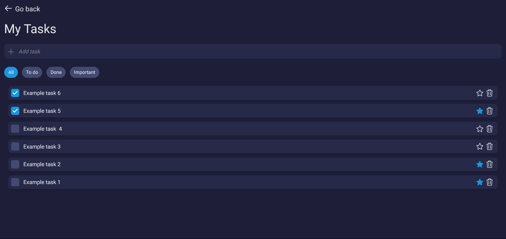

# Nirvana - Productivity Assistant

## Live example 🌐

_This option will be added in the future_

## About ✍️

The main goal is to make an all-in-one productivity application, designed to help users effectively manage their daily tasks, take notes and focus. With its intuitive interface and a comprehensive set of features, this application will simplify the process of organizing daily routine and achieving goals.

## Features 📋

**Focus space**

- Lofi music player
- Pomodoro productivity timmer

**Task list**

- Adding user-written tasks
- Editing and deleting existing tasks
- Prioritizing - tasks can be highlighted as important
- Filtering tasks by category

**Notepad**

- creating user-written notes
- Editing and deleting existing notes

## Future updates ⌛

**To do list**

- Sorting

**Music player**

- Autoplay
- More music genres

## Technological facilities 🛠️

### Main architecture

- Application is based on Angular 15. Navigation is handled using built-in **RouterModule**. To facilitate communication between components I have used Angular's **EventEmitters** and @Input/@Output decorators.
- **Two-way data binding** is handled using Angular's FormsModule.
- UI is mainly done with the **TailwindCSS** framework, CSS and **Material UI**.

### How data is stored?

- Since the project is strictly frontend, the data is stored in the **browser's local storage**.

### How music player works?

- Music files are stored locally.
- Song related information such as title and artist are stored in a **JSON file**
- Data from JSON is implemented in the code using the **Fetch Api**.
- The player works based on the native **HTMLAudioElement**.

## Installation Guide ⚙️

This project is based on Angular framework and uses TailwindCSS and MaterialUI libraries. Here's a step-by-step guide to help you get started with the project.

### Prerequisites

Before you begin, make sure you have the following installed on your machine:

- Node.js (version 14.0 or later)
- npm package manager (version 6.0 or later)

### Installation

Let's start with installing all dependencies. Move to the app main workspace and run:

    npm i

To create a localhost port you should type:

    ng serve

Your application is ready at port 4200.

    http://localhost:4200/

## Special thanks 🙏🏽

Special thanks to my fiancee - for inspiration, motivation and invaluable manual tests.
