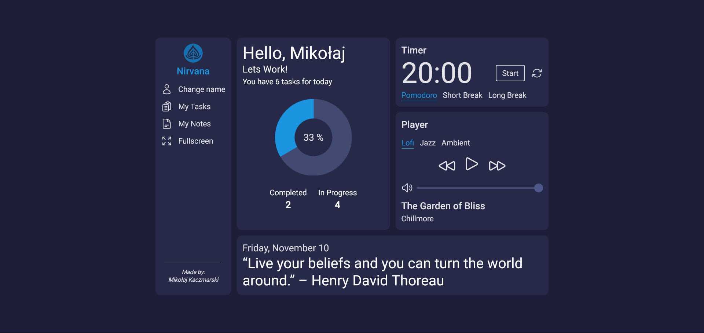

# Nirvana - Productivity Assistant

## Live example 🌐

https://nirvana.kaczmarski.dev

## About ✍️

A CRUD application that I made while learning the basics of Angular.
The main goal was to make an all-in-one productivity application, designed to help users effectively manage their daily tasks, take notes and focus.

## Features 📋

**Main dashboard**

- Lofi music player
- Pomodoro productivity timmer
- Progress chart

**Task list**

- Adding user-written tasks
- Editing and deleting existing tasks
- Prioritizing - tasks can be highlighted as important
- Filtering tasks by category

**Notepad**

- creating user-written notes
- Editing and deleting existing notes

## Technological facilities 🛠️

### Main architecture

- Application is based on Angular 15. Navigation is handled using built-in **RouterModule**. To facilitate communication between components I have used Angular's **EventEmitters**, @Input/@Output decorators and custom **Services**.
- UI is mainly done with the **TailwindCSS** framework and vanilla CSS.

### How data is stored?

- Since the project is strictly frontend, the data is stored in the **browser's local storage**.

### How music player works?

- Music files are stored locally.
- Song related information such as title and artist are stored in a **JSON file**
- Data from JSON is fetched using the **Fetch Api**.
- The player's core is the native **HTMLAudioElement**.

## Installation Guide ⚙️

This project is based on Angular framework and uses TailwindCSS and Chart.js libraries. Here's a step-by-step guide to help you get started with the project.

### Prerequisites

Before you begin, make sure you have the following installed on your machine:

- Node.js (version 14.0 or later)
- npm package manager (version 6.0 or later)

### Installation

Let's start with installing all dependencies. Move to the app main workspace and run:

    npm i

To create a localhost port you should type:

    ng serve

Your application is ready at port 4200.

    http://localhost:4200/

## License and Copyrights 📜

- The application is publicly available under the MIT license.
- The project is educational and is not used for commercial purposes.
- Music was taken from https://pixabay.com as royalty free and is not mine.

## Special thanks 🙏🏽

Special thanks to my fiancee - for inspiration, motivation and invaluable manual tests.
